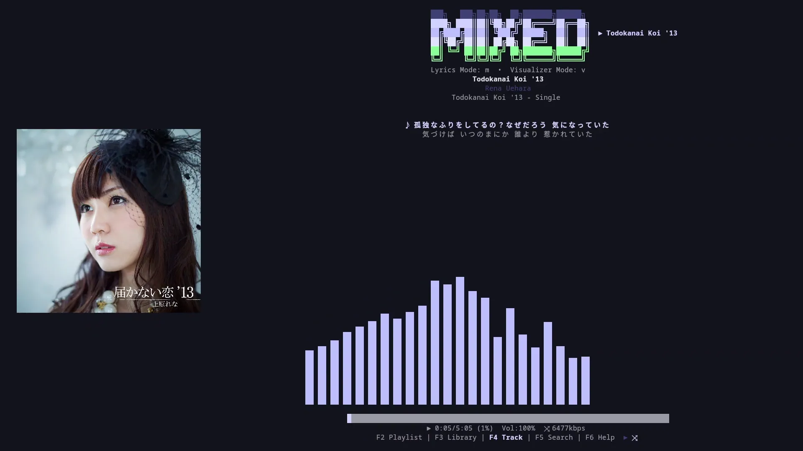
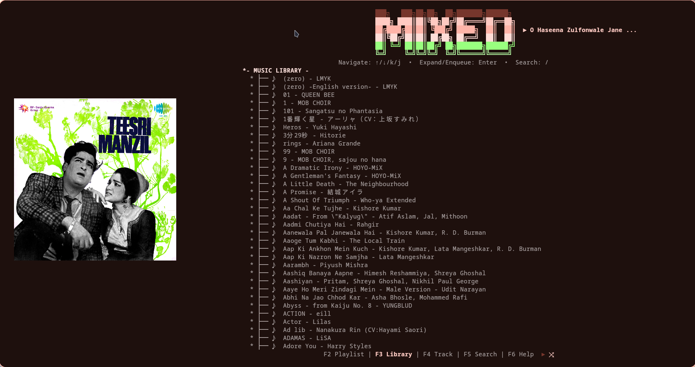
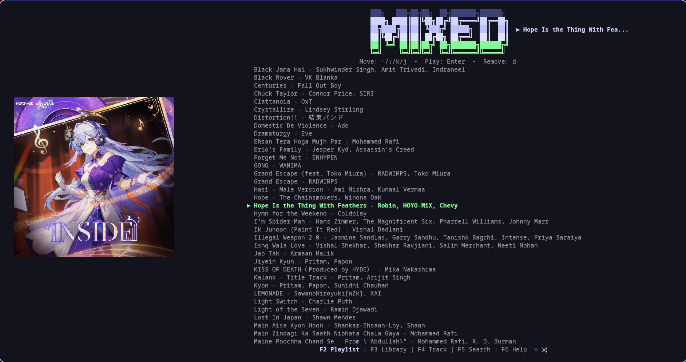
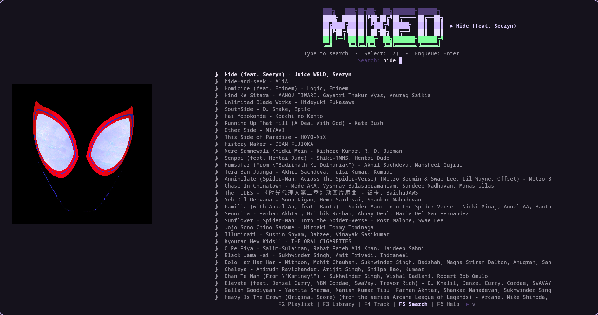
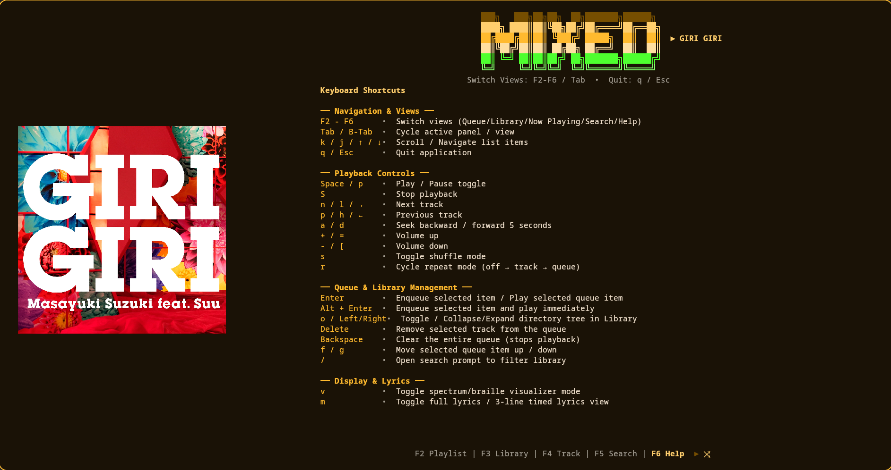

# mixed


[](https://www.gnu.org/licenses/gpl-3.0)

> A next-generation terminal music player — built with Rust, designed for performance freaks.

---

## Origin & Inspiration

**mixed** is heavily inspired by the phenomenal C-based TUI player **[kew](https://github.com/ravachol/kew)**. `kew` is an incredible piece of software with elegant design and rock-solid audio playback. So why build another one?

This project was born from a desire to push beyond what's possible with a C foundation:

- **Design Overhaul** — A unique high-contrast **Neon-Noir / Material You** aesthetic with Sixel album art rendering, braille-dot visualizers, and a deeply customizable layout system.
- **Lock-Free Concurrency** — All cross-thread state synchronization uses atomic primitives (`AtomicBool`, `AtomicU64`, `AtomicU8`) instead of mutexes, eliminating contention on the audio hot-path.
- **Native Android Integration** — Asynchronous Termux widget control via Unix Domain Socket IPC, giving Android 13+ users lock-screen notification media buttons without rooting.
- **High-Performance Rendering** — Sixel image pooling with XDG-cached cover art protocols, zero-allocation FFT spectrum frames, and an adaptive rendering loop that idles at 0% CPU when paused.

**The Real Reason** - I started this project at the beginning of Janunary 2026 as part of my new year resolution that after learning rust of more than 6 months I will try to build a major project on my own in rust. *'kew'* was major inspiration to try build a minimilist music player with things I like (kew had everything I like), but I wanted to try build it on my own for practice.
After 5 months the project was looking and working as intented with the plan and idea I had in mind, but there were many issue that I wasn't able to solve so I finanlly used AI for the help.
but I'm proud that build almost 70-75% of the project on my own just using Google search, looking at other rust based music players, documentaions and the old way of wrtting code.
But when I stuck for weeks without progess I finally used AI for helping and writting code. It didn't feel that good when I was working on the project myself but at the same time I was happy to finally see some progess on my stagnat project.

---

## Visual Showcase

### Now Playing


### Library


### Playlist


### Search


---

## Core Features

### 🔊 High-Performance Audio Engine
Powered by **Rodio** and **Symphonia** with lock-free, zero-allocation sample tracking. Audio decoding runs on an isolated background thread with `nice(-10)` priority elevation on Linux. Sample data flows to the visualizer through a batched ring buffer (`BATCH_SIZE = 64`) that reduces mutex acquisitions by 64× compared to per-sample locking.

### ⏩ Hybrid Seek System
Bulletproof seeking that natively calls `try_seek()` on indexed audio formats (FLAC, WAV) and seamlessly falls back to a **sample-discarding iterator** for unseekable or variable-bitrate files (MP3, Ogg). Backward seeks gracefully reopen the decoder and fast-forward via atomic `skip_request` counters — no stalls, no glitches.

### 📱 Cross-Platform Background Media Controls
Full **MPRIS D-Bus** integration for Linux compositors (GNOME, KDE, Sway) with real-time `PropertiesChanged` signal emission for metadata, playback status, volume, shuffle, and loop state. On Android, a native **IPC proxy bridge** using `termux-notification` maps ⏮/⏯/⏭ button taps to Unix Domain Socket commands for lock-screen widget control.

### ⚡ Zero-Spin Event Loop
Intelligent, adaptive rendering powered by `crossbeam_channel::select!` multiplexing. The visualizer thread fires wake-up signals at **~30 fps** (34ms cadence) through a `bounded(1)` channel when music is playing. When idle, the FFT thread decays to silence and the main loop drops to **near 0% CPU** — no busy-waiting, no wasted cycles.

### 📐 Responsive Screen Guard
Dynamic terminal size checking that automatically shifts to a minimal portrait notification on narrow screens (e.g., phones in Termux). Resize events are debounced at 100ms to prevent thrashing, and Sixel cover art is re-scaled on every confirmed resize.

---

## Installation

### Method 1: Pre-compiled Binaries (Recommended)

You can download the pre-compiled binary for your system from the **[Releases](../../releases)** page.

#### Linux (x86_64)
1. Download `mixed-v0.1.2-x86_64-unknown-linux-gnu.tar.gz`.
2. Extract the archive:
   ```bash
   tar -xzf mixed-v0.1.2-x86_64-unknown-linux-gnu.tar.gz
   ```
3. Move the `mixed` binary to your system PATH (e.g. `/usr/local/bin`):
   ```bash
   sudo mv mixed /usr/local/bin/
   ```
4. Run the player by typing `mixed` in your terminal.

#### macOS (Apple Silicon or Intel)
1. Download either `mixed-v0.1.2-aarch64-apple-darwin.tar.gz` (Apple Silicon) or `mixed-v0.1.2-x86_64-apple-darwin.tar.gz` (Intel).
2. Extract the archive:
   ```bash
   tar -xzf mixed-v0.1.2-*.tar.gz
   ```
3. Move `mixed` to a directory in your PATH (e.g. `/usr/local/bin`):
   ```bash
   mv mixed /usr/local/bin/
   ```
4. *Note:* If macOS Gatekeeper prevents execution, run the following to bypass the developer warning:
   ```bash
   xattr -cr /usr/local/bin/mixed
   ```

#### Windows (x86_64)
1. Download `mixed-v0.1.2-x86_64-pc-windows-msvc.zip`.
2. Extract the `.zip` file.
3. Move `mixed.exe` to a folder of your choice and run it in a terminal emulator (PowerShell, Command Prompt, or Git Bash).

#### Android (Termux)
1. Install the `termux-api` package in Termux:
   ```bash
   pkg install termux-api
   ```
2. Make sure you have the **Termux:API** application installed from F-Droid to enable widget interactions.
3. Download `mixed-v0.1.2-aarch64-linux-android.tar.gz`.
4. Extract the binary inside Termux and make it executable:
   ```bash
   tar -xzf mixed-v0.1.2-aarch64-linux-android.tar.gz
   chmod +x mixed
   mv mixed $PREFIX/bin/
   ```

---

### Method 2: Build from Source

If you have Rust and Cargo installed:

```bash
# Clone the repository
git clone https://github.com/MSpider3/mixed.git
cd mixed

# Build the optimized release binary
cargo build --release

# Run
./target/release/mixed
```

The release profile uses `opt-level = 3`, fat LTO, single codegen unit, and symbol stripping for maximum performance.

---

## Keybind Reference

| Keybind | Action | Context |
|---|---|---|
| `F2 - F6` | Switch views (Queue/Library/Now Playing/Search/Help) | Navigation |
| `Tab` / `Shift+Tab` | Cycle active panel / view | Navigation |
| `k` / `j` / `↑` / `↓` | Scroll / Navigate list items | Navigation |
| `q` / `Esc` | Quit / Graceful Exit | System |
| `Space` / `p` | Play / Pause toggle | Playback |
| `S` | Stop playback | Playback |
| `n` / `l` / `→` | Next track | Playback |
| `p` / `h` / `←` | Previous track | Playback |
| `a` / `d` | Seek backward / forward 5 seconds | Playback |
| `+` / `=` | Volume up | Playback |
| `-` / `[` | Volume down | Playback |
| `s` | Toggle shuffle mode | Playback |
| `r` | Cycle repeat mode (off → track → queue) | Playback |
| `Enter` | Enqueue selected item / Play selected queue item | Queue / Library |
| `Alt + Enter` | Enqueue selected item and play immediately | Queue / Library |
| `o` / `←` / `→` | Toggle / Collapse/Expand directory tree | Library |
| `Delete` | Remove selected track from the queue | Queue |
| `Backspace` | Clear the entire queue (stops playback) | Queue |
| `f` / `g` | Move selected queue item up / down | Queue |
| `/` | Open search prompt to filter library | Library |
| `v` | Toggle spectrum/braille visualizer mode | Display |
| `m` | Toggle full lyrics / 3-line timed lyrics view | Display |

### Help Panel


---

## Future Roadmap

- [ ] 🎵 **Spotify Integration** — Native account streaming with an ultra-minimalist layout interface that preserves the terminal-first experience.

- [ ] 📺 **YouTube Music Integration** — Direct streaming playback mapped to background process queues, bringing the full YTM catalog into your terminal.

- [ ] ☁️ **Cloud Streaming Architecture** — Universal hooks for streaming external media repositories without local cache bloat. Pluggable provider backends with a unified `Source` trait.

- [ ] 🎨 **Theme Engine** — User-defined TOML theme files with hot-reload support for full color palette and layout customization.

- [ ] 🔌 **Plugin System** — Lua/WASM-based extension API for community-built visualizers, metadata scrapers, and scrobbler integrations.

---

## Contributing

Contributions are welcome and deeply appreciated! Whether it's a performance tweak, a bug fix, a new theme module, or a documentation improvement — every PR makes **mixed** better.

**How to contribute:**

1. **Open an Issue** — Found a bug or have a feature idea? Start by [opening an issue](../../issues) so we can discuss the approach.
2. **Fork & Branch** — Fork the repository, create a feature branch (`feature/your-feature`), and develop your changes.
3. **Submit a Pull Request** — Open a PR against `main` with a clear description of your changes. Include screenshots for UI changes and benchmark numbers for performance work.

**Areas where help is especially welcome:**
- 🐧 **Platform testing** — macOS, Windows, and exotic terminal emulators
- 🎨 **Theme contributions** — Custom color palettes and layout presets
- 🌐 **Internationalization** — Non-ASCII filename handling edge cases
- 📊 **Performance profiling** — Flamegraphs, memory analysis, latency benchmarks

---

## License

This project is licensed under the **GNU General Public License v3.0** — see the [LICENSE](LICENSE) file for details.

`mixed` is free software: you can redistribute it and/or modify it under the terms of the GNU GPL as published by the Free Software Foundation, either version 3 of the License, or (at your option) any later version.
