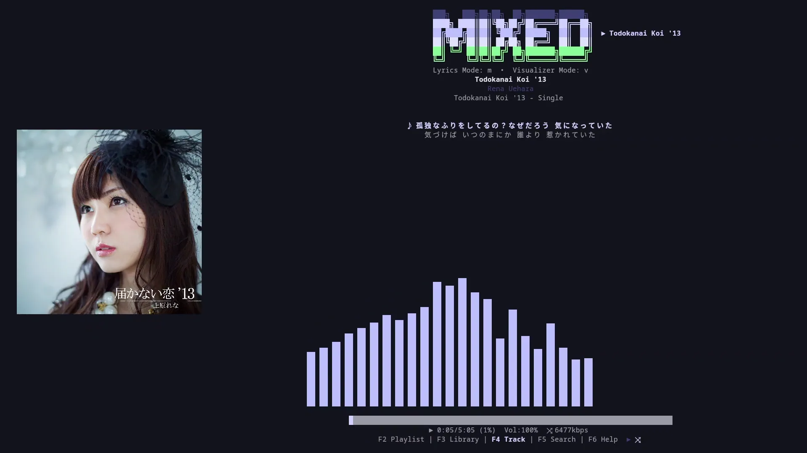
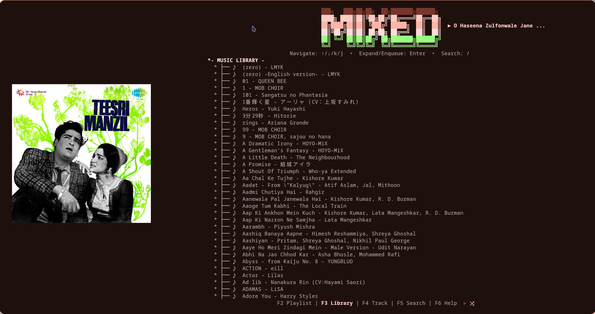
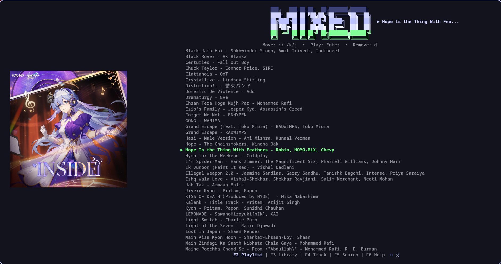
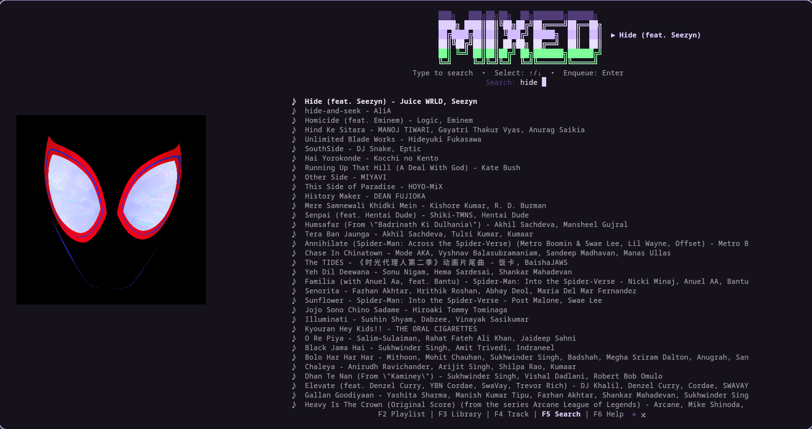

# mixed


[](https://www.gnu.org/licenses/gpl-3.0)

> A next-generation terminal music player — built with Rust, designed for performance freaks.

---

## Origin & Inspiration

**mixed** is heavily inspired by the phenomenal C-based TUI player **[kew](https://github.com/ravachol/kew)**. `kew` is an incredible piece of software with elegant design and rock-solid audio playback. So why build another one?

This project was born from a desire to push beyond what's possible with a C foundation:

- **Design Overhaul** — A unique high-contrast **Neon-Noir / Material You** aesthetic with Sixel album art rendering, real-time spectrum & braille visualizers, and a deeply customizable layout system.
- **Lock-Free Concurrency** — Cross-thread state synchronization uses atomic primitives (`AtomicBool`, `AtomicU64`, `AtomicU8`) instead of mutexes, eliminating contention on the audio hot-path.
- **Native MPRIS Media Controls** — Full MPRIS D-Bus integration for Linux desktop environments (GNOME, KDE, Sway, Waybar, playerctl).
- **High-Performance Rendering** — Sixel image pooling with XDG-cached cover art protocols, zero-allocation FFT spectrum frames, and an adaptive rendering loop that idles at 0% CPU when paused.

**The Real Reason** - I started this project at the beginning of January 2026 as part of my new year resolution that after learning Rust for more than 6 months I will try to build a major project on my own in Rust. *'kew'* was major inspiration to try build a minimalist music player with things I like, but I wanted to try build it on my own for practice.

---

## Visual Showcase

### Now Playing


### Library


### Playlist


### Search


---

## Core Features

### 🔊 High-Performance Audio Engine
Powered by **Rodio** and **Symphonia** with lock-free, zero-allocation sample tracking. Audio decoding runs on an isolated background thread with `nice(-10)` priority elevation on Linux. Sample data flows to the visualizer through a batched ring buffer (`BATCH_SIZE = 64`) that reduces mutex acquisitions by 64× compared to per-sample locking.

### ⏩ Hybrid Seek System
Bulletproof seeking that natively calls `try_seek()` on indexed audio formats (FLAC, WAV) and seamlessly falls back to a **sample-discarding iterator** for unseekable or variable-bitrate files (MP3, Ogg). Backward seeks gracefully reopen the decoder and fast-forward via atomic `skip_request` counters — no stalls, no glitches.

### 🐧 MPRIS Background Media Controls (Linux)
Full **MPRIS D-Bus** integration for Linux compositors (GNOME, KDE, Sway, Hyprland) with real-time `PropertiesChanged` signal emission for metadata, playback status, volume, shuffle, and loop state.

### ⚡ Zero-Spin Event Loop
Intelligent, adaptive rendering powered by `crossbeam_channel::select!` multiplexing. The visualizer thread fires wake-up signals at **~30 fps** (34ms cadence) through a `bounded(1)` channel when music is playing. When idle, the FFT thread decays to silence and the main loop drops to **near 0% CPU** — no busy-waiting, no wasted cycles.

### 🎨 Native Terminal Theme Integration
**mixed** inherits standard ANSI color palette codes and uses `Color::Reset` for default text. This means the player automatically respects and adapts to your terminal emulator's custom theme (e.g. Catppuccin, Gruvbox, Nord, Dracula) for a consistent, native desktop look.

### 🖼 Sixel & Kitty Cover Art
Album art is rendered directly in the terminal using high-performance image protocols (Sixel and Kitty Graphics Protocol) powered by `ratatui-image`. To see high-resolution cover art, use an image-enabled terminal emulator such as Kitty, WezTerm, Foot, Konsole, or Alacritty (v0.14+ with Sixel support enabled). The player automatically falls back to a text placeholder if image protocols are unsupported.

### 🎛️ Interactive Mini-Controls & Centered Layout
A sleek, responsive transport widget (`[⏮  ▶/⏸  ⏭  +  -  ∅]`) is positioned directly beneath the album art in the left pane across the **Playlist (F2)**, **Library (F3)**, **Search (F5)**, and **Help (F6)** tabs. Both cover art and mini-controls are vertically centered together as a unified block in the middle of the left pane, featuring dedicated mouse hit targets for Previous, Play/Pause, Next, Volume adjustments, and Playlist clearing (`∅`).

### 📜 Line-Free Visual Scrollbars
Lists across the Playlist, Library, and Search views feature visual vertical scrollbars (`ratatui::widgets::Scrollbar`) when content overflows screen height. Designed with a clean, modern aesthetic: track lines and arrows are omitted, showing only the solid handle block (`█`) with full mouse click and drag seeking support.

### 🔔 Native Desktop Notifications (Linux)
Native desktop notifications are automatically dispatched over D-Bus (`org.freedesktop.Notifications`) whenever tracks change, displaying the song title, artist, and album without interrupting terminal focus.

### 🌐 Instant Browser Search for Song & Artist
Quickly explore artist discography, lyrics, or background information in your default web browser (Google Search):
- Press `b` or `B` anywhere to immediately launch a web search for the currently playing artist.
- In the **Track (F4)** view, click directly on the **song title** to search for the song, or click the **artist name** to search for the artist.
- All browser subcommands run with isolated `stdio` redirected to `/dev/null`, preventing any external browser warnings or logs from corrupting the TUI.

### 🌐 Multi-Source Streaming (Spotify, YouTube Music & Local)
Seamlessly search, browse, enqueue, and play music across multiple sources in one unified player:
- **Local Library (`Ctrl+1` / `Alt+1`)**: Zero-dependency offline audio playback for FLAC, MP3, WAV, and OGG files with embedded metadata and synchronized lyrics.
- **Spotify (`Ctrl+2` / `Alt+2`)**: Search and library navigation (Liked Songs, Playlists, Albums) with raw PCM playback powered by `librespot` (requires Spotify Premium).
- **YouTube Music (`Ctrl+3` / `Alt+3`)**: Search and browse YouTube Music tracks with background audio caching and 50% sequential prefetch via `yt-dlp`. Playback starts while the track is still downloading. Search and playback work without an account; a browser cookie adds your own library.
- **Unified Queue (`Ctrl+4` / `Alt+4`)**: Mix tracks from local files, Spotify, and YouTube in a single queue with automatic cross-source advancing. The queue, including remote tracks, is restored on the next launch.

Remote libraries and search results are shown as a tree like the local library: `Enter` opens and closes albums, playlists and folders. Each source remembers its own tab and cursor. A track that fails to load is skipped, and playback stops after three failures in a row. Lyrics are available for local files only.

---

## Installation & Runtime Requirements

> **Runtime Requirements:**
> - **Local Playback**: Fully standalone and self-contained binary with all decoders statically compiled in. Zero external runtime dependencies.
> - **YouTube Music Streaming**: Requires [`yt-dlp`](https://github.com/yt-dlp/yt-dlp) installed and available in your system `$PATH` (or set `yt_dlp_path` in `config.json`).
> - **Spotify Streaming**: Requires **Spotify Premium**. You sign in from the app with two approvals in your browser (PKCE authorization code flow, no secret and no developer account required). A Spotify Developer Client ID of your own is optional.
> - **Shortcut Fallback**: `Ctrl+1..4` and `Shift+Enter` are only reported by terminals that support the kitty keyboard protocol (Kitty, Foot, WezTerm, Ghostty, recent Alacritty). Elsewhere, use `Alt+1..4` to switch sources.

### Authentication & API Setup

For detailed instructions on configuring streaming sources, see the dedicated guides:
- **[Spotify Setup & Authentication](docs/spotify.md)** — Sign in from the app, optionally with your own Client ID, and see what is stored and how playback connects.
- **[YouTube Music Setup](docs/youtube.md)** — Install `yt-dlp`, optionally sign in with a browser cookie to see your library, and learn how caching and play-while-downloading work.

### Files & Configuration

`mixed` keeps its files in the standard per-user directories. The paths below are for Linux; macOS and Windows use their platform equivalents (the setup guides list the exact `credentials.json` location for each).

| File | Purpose |
|---|---|
| `~/.config/mixed/config.json` | Settings: music directory, volume, visualizer, notifications, `yt_dlp_path`, `yt_cache_mb` |
| `~/.config/mixed/credentials.json` | Spotify Client ID and tokens, YouTube cookie (owner-only permissions) |
| `~/.local/share/mixed/state.json` | Saved queue and playback position |
| `~/.cache/mixed/yt/` | Downloaded YouTube audio (limited by `yt_cache_mb`, default 512 MB) |
| `~/.cache/mixed/mixed.log` | Diagnostics and errors (rotated at 5 MB). Set `MIXED_DEBUG=1` to print them to the terminal instead |

### Method 1: Pre-compiled Binaries (Recommended)

You can download the pre-compiled binary for your system from the **[Releases](../../releases)** page.

#### Linux (x86_64)
1. Download `mixed-v1.7.0-x86_64-unknown-linux-gnu.tar.gz`.
2. Extract the archive:
   ```bash
   tar -xzf mixed-v1.7.0-x86_64-unknown-linux-gnu.tar.gz
   ```
3. Move the `mixed` binary to your system PATH (e.g. `/usr/local/bin`):
   ```bash
   sudo mv mixed /usr/local/bin/
   ```
4. Run the player by typing `mixed` in your terminal.

#### macOS (Apple Silicon or Intel)
1. Download either `mixed-v1.7.0-aarch64-apple-darwin.tar.gz` (Apple Silicon) or `mixed-v1.7.0-x86_64-apple-darwin.tar.gz` (Intel).
2. Extract the archive:
   ```bash
   tar -xzf mixed-v1.7.0-*.tar.gz
   ```
3. Move `mixed` to a directory in your PATH (e.g. `/usr/local/bin`):
   ```bash
   mv mixed /usr/local/bin/
   ```
4. *Note:* If macOS Gatekeeper prevents execution, run the following to bypass the developer warning:
   ```bash
   xattr -cr /usr/local/bin/mixed
   ```

#### Windows (x86_64)
1. Download `mixed-v1.7.0-x86_64-pc-windows-msvc.zip`.
2. Extract the `.zip` file.
3. Move `mixed.exe` to a folder of your choice and run it in a terminal emulator (Windows Terminal, PowerShell, or Command Prompt).

---

### Method 2: Build from Source

If you have Rust and Cargo installed:

```bash
# Clone the repository
git clone https://github.com/MSpider3/mixed.git
cd mixed

# Build the optimized release binary
cargo build --release

# Run
./target/release/mixed
```

The release profile uses `opt-level = 3`, fat LTO, single codegen unit, and symbol stripping for maximum performance.

---

## CLI Usage

```bash
# Print help documentation
mixed --help

# Print version
mixed --version

# Open mixed with a specific music directory
mixed ~/Music
# or
mixed --dir ~/Music

# Directly play an audio file on startup
mixed /path/to/song.mp3
# or
mixed --play /path/to/song.flac
```

---

## Keybind & Mouse Reference

### Keyboard Controls

| Keybind | Action | Context |
|---|---|---|
| `F2 - F6` | Switch views (Queue/Library/Now Playing/Search/Help) | Navigation |
| `Ctrl+1` / `Alt+1` | Switch to Local Library Source | Sources |
| `Ctrl+2` / `Alt+2` | Switch to Spotify Source (requires Premium) | Sources |
| `Ctrl+3` / `Alt+3` | Switch to YouTube Music Source (streams via yt-dlp) | Sources |
| `Ctrl+4` / `Alt+4` | Switch to Unified Queue (all sources) | Sources |
| `Tab` / `Shift+Tab` | Cycle active panel / view | Navigation |
| `k` / `j` / `↑` / `↓` | Scroll / Navigate list items | Navigation |
| `q` / `Ctrl+C` | Quit / Graceful Exit | System |
| `Esc` | Back to the queue view | Navigation |
| `Space` / `p` | Play / Pause toggle | Playback |
| `S` | Stop playback | Playback |
| `n` / `l` / `→` | Next track | Playback |
| `h` / `←` | Previous track (restarts track if >3s elapsed) | Playback |
| `a` / `d` | Seek backward / forward 5 seconds | Playback |
| `+` / `=` | Volume up | Playback |
| `-` / `[` | Volume down | Playback |
| `s` | Toggle shuffle mode | Playback |
| `r` | Cycle repeat mode (off → track → queue) | Playback |
| `Enter` | Enqueue or dequeue selected item / Play selected queue item | Queue / Library / Search |
| `Enter` | Open or close the selected album, playlist or folder; sign in when not connected | Spotify / YouTube |
| `c` | Sign in with your own Spotify Client ID | Spotify Library |
| `Alt + Enter` | Enqueue selected item and play immediately | Library / Search |
| `Shift + Enter` | Enqueue selected track or folder to play next | Library / Search |
| `o` / `←` / `→` | Toggle / Collapse/Expand directory tree | Local Library |
| `Delete` | Remove selected track from the queue | Queue |
| `Backspace` | Clear the entire queue (stops playback) | Queue |
| `f` / `g` | Move selected queue item up / down | Queue |
| `/` | Open search for the active source | Library |
| `v` | Toggle spectrum/braille visualizer mode | Display |
| `m` | Toggle full lyrics / 3-line timed lyrics view | Display |
| `b` / `B` | Search artist in default web browser | Web Search |

### Mouse Interaction

- **Left Pane Mini-Controls**: Click `⏮`, `▶ / ⏸`, `⏭`, `+`, `-`, or `∅` directly beneath the cover art.
- **Progress Bar**: Click or drag anywhere on the progress bar to seek instantly.
- **Scrollbar**: Click or drag along the vertical scrollbar track to jump through lists.
- **Footer Tabs**: Click on `F2 Playlist`, `F3 Library`, `F4 Track`, `F5 Search`, or `F6 Help` to switch views.
- **Source Row**: Click `local`, `spotify`, `youtube`, or `queue` above the footer tabs to switch sources.
- **Lists**: Click a row to select it; click the selected row again to activate it (same as `Enter`).
- **Track & Artist Search**: In the Track (F4) tab, click the song title or artist name to launch an instant web search.

---

## Testing & Verification

`mixed` includes a fully self-contained test suite with synthetic audio decoders and headless TUI integration tests. See [`tests/README.md`](tests/README.md) for full testing instructions.

```bash
# Run all tests
cargo test
```

---

## License

This project is licensed under the **GNU General Public License v3.0 (GPLv3)** — see the [LICENSE](LICENSE) file for details.
